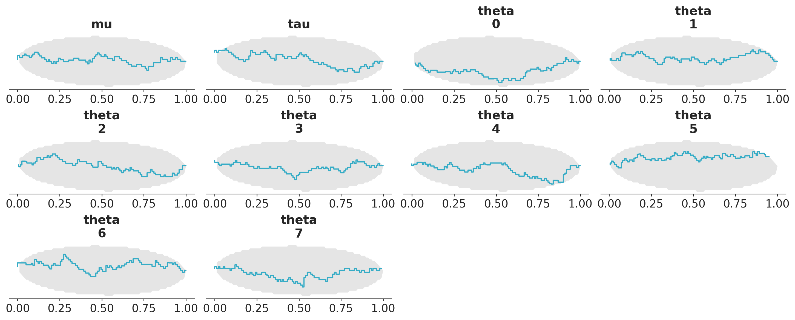

# Simuk

Simuk is a Python library for simulation-based calibration (SBC) and the generation of synthetic data.
Simulation-Based Calibration is a method for validating Bayesian inference by checking whether the posterior distributions align with the expected theoretical results derived from the prior.

Simuk works with [PyMC](http://docs.pymc.io), [Bambi](https://bambinos.github.io/bambi/) and [NumPyro](https://num.pyro.ai/en/latest/index.html) models.

## Installation

May be pip installed from github:

```bash
pip install simuk
```

## Quickstart

1. Define a PyMC or Bambi model. For example, the centered eight schools model:

    ```python
    import numpy as np
    import pymc as pm
    from arviz_plots import plot_ecdf_pit

    data = np.array([28.0, 8.0, -3.0, 7.0, -1.0, 1.0, 18.0, 12.0])
    sigma = np.array([15.0, 10.0, 16.0, 11.0, 9.0, 11.0, 10.0, 18.0])

    with pm.Model() as centered_eight:
        mu = pm.Normal('mu', mu=0, sigma=5)
        tau = pm.HalfCauchy('tau', beta=5)
        theta = pm.Normal('theta', mu=mu, sigma=tau, shape=8)
        y_obs = pm.Normal('y', mu=theta, sigma=sigma, observed=data)
    ```
2. Pass the model to the `SBC` class, and run the simulations. This will take a while, as it is running the model many times.
    ```python
    sbc = SBC(centered_eight,
            num_simulations=100, # ideally this should be higher, like 1000
            sample_kwargs={'draws': 25, 'tune': 50})

    sbc.run_simulations()
    ```
    ```python
    79%|███████▉  | 79/100 [05:36<01:29,  4.27s/it]
    ```

3. Plot the empirical CDF for the difference between prior and posterior. The lines
should be close to uniform and within the oval envelope.

    ```python
    plot_ecdf_pit(sbc.simulations,
                visuals={"xlabel":False},
    );
    ```



## References

- Talts, S., Betancourt, M., Simpson, D., Vehtari A., and Gelman A. (2018). [Validating Bayesian Inference Algorithms with Simulation-Based Calibration](https://doi.org/10.48550/arXiv.1804.06788).
- Modrák, M., Moon, A, Kim, S., Bürkner, P., Huurre, N., Faltejsková, K., Gelman A and Vehtari, A.(2023). [Simulation-based calibration checking for Bayesian computation: The choice of test quantities shapes sensitivity](https://doi.org/10.1214/23-BA1404). Bayesian Analysis.
- Säilynoja, T., Marvin Schmitt, Paul-Christian Bürkner and Aki Vehtari (2025). [Posterior SBC: Simulation-Based Calibration Checking Conditional on Data](https://doi.org/10.48550/arXiv.2502.03279).
